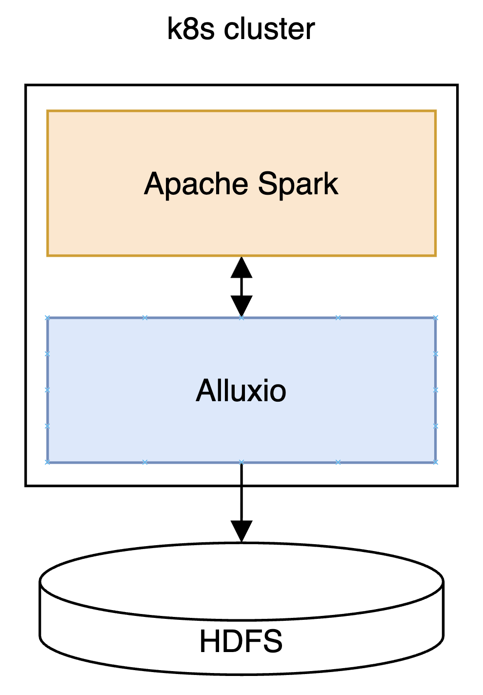
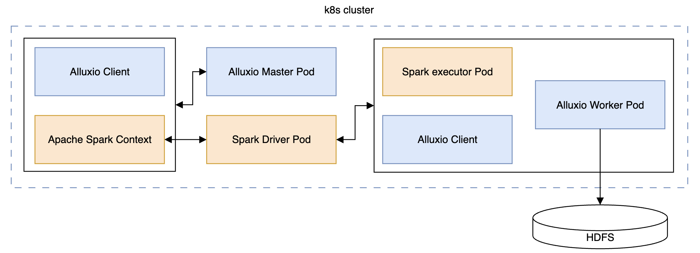

# Ensuring Data Locality in Kubernetes

_by Seunggi Hong_

**_This article is based on a paper I authored and submitted to the Korea Contents Association Conference._**

## Introduction

Large-scale data processing, machine learning, and deep learning workloads are becoming core infrastructure in many enterprises and research institutions. These workloads require not only storage capacity but also fast data access and efficient resource management.

Recently, Kubernetes has become the de facto standard for cloud-native environments, and big data platforms are increasingly being operated within Kubernetes clusters. The challenge, however, is that Spark jobs running inside Kubernetes cannot guarantee data locality when accessing external HDFS.

In this article, I introduce a Spark–HDFS integration architecture using Alluxio to address this issue and share experimental results and insights.

## Why is Data Locality Important?

Data locality refers to the physical closeness between the compute node and the storage node that holds the required data.

- Data transfer across nodes consumes significant time and network resources.
- If the data resides on the same node, a Spark Executor can access it much faster, thereby reducing overall processing time.

Without data locality, even a large cluster may suffer from network bottlenecks that degrade performance.

## Proposed Architecture

In this study, Alluxio was deployed inside the Kubernetes cluster, and the external HDFS was mounted onto Alluxio so that Spark could read data through it.
• Spark & Alluxio: Deployed as Pods within the Kubernetes cluster
• Alluxio’s role: Provides external HDFS data as an in-memory cache
• Effect: Spark Executors access data locally through the Alluxio client co-located in the same node

  

The architecture diagram illustrates the tight integration of Spark and Alluxio within Kubernetes, with external HDFS mounted to Alluxio, thereby shortening the data access path.

## Workflow

The execution process is as follows: 1. When a Spark job is submitted, the Alluxio client is deployed alongside it. 2. The Alluxio Master provides information on the node where the data resides. 3. The Spark Executor runs on that node and retrieves the data through Alluxio, ensuring locality.

  

The flow chart shows how Spark Executors and Alluxio clients run in the same Pod, minimizing data transfer costs.

## Experimental Setup and Results

The experiment was conducted on a 4-node cluster.

- Software: Kubernetes 1.28.6, Spark 3.4.0, Alluxio 2.9.3, HDFS 3.3.0
- Hardware: Mixed SSD and HDD storage, multi-core Intel Xeon CPUs, total memory ~558GB
- Dataset: ~4GB CSV file

Performance Comparison

- Proposed method (K8s + Spark + Alluxio + HDFS): Avg. 0.96s
- Traditional method (YARN + Spark + HDFS): Avg. 0.78s

Although execution time slightly increased compared to the YARN-based approach, the results confirm that Kubernetes’ advantage of flexible resource allocation can be achieved without significant performance degradation.

## Conclusion

This research proposes a way to ensure data locality for HDFS data in Kubernetes-based Spark clusters.

- Alluxio’s in-memory caching and network optimization allow Spark Executors to access data quickly.
- External HDFS is integrated with Kubernetes workloads to provide an optimized big data architecture.
- Future work will expand dataset size and apply various operations for further performance evaluation.

For those considering container-based big data environments, this case study can serve as a useful reference.
