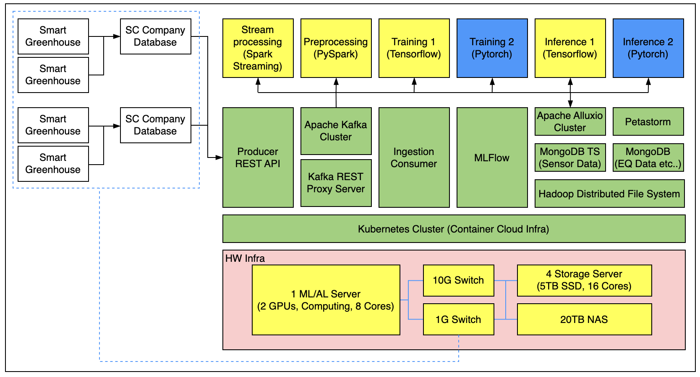

# Scalable MLOps on Container-Based Cloud

_by Seunggi Hong_

**_This article is based on a paper I personally wrote and submitted to ICCC 2024, The Korea Contents Association._**

## Why MLOps in Agriculture?

Anyone who has deployed AI/ML models into production knows that **operations are harder than coding**.  
In smart greenhouses, where real-time sensor data continuously streams in, bottlenecks in data pipelines or delays in model deployment can directly cause **failures in controlling crop growth environments**.

Therefore, it’s not enough to just build models. A robust **MLOps framework covering data ingestion–preprocessing–training–deployment–inference–control** is essential.

## Architecture Design Philosophy

  

The framework I designed follows the principle of **“Containerize Everything.”**

- Run each service as an independent Pod on **Kubernetes** for fault isolation, auto-healing, and horizontal scaling.
- Loosely coupled components allow easy replacement or upgrades of individual modules.
- Data engineers, ML engineers, and operators collaborate on the same infrastructure.

## Core Components

### 1. Data Ingestion

- **Apache Kafka REST Proxy**  
  Collects time-series data from greenhouse sensors and actuators.  
  → REST Proxy allows easy communication with HTTP-based devices.

### 2. Data Lake (Storage)

- **MongoDB**: Stores metadata requiring fast lookups and management.
- **HDFS**: Stores large raw data and massive training datasets.

This combination balances **speed + capacity**.

### 3. Distributed Training

- **Ray** enables parallel training and distributed inference.  
  Compared to Spark, it’s lightweight and Pythonic, making parallelization fast and simple.

### 4. Workflow Orchestration

- **Apache Airflow** manages the full pipeline as DAGs.  
  Preprocessing, training, evaluation, and deployment are defined as tasks for automated execution and monitoring.

### 5. Model Management & Serving

- **MLflow** handles model versioning, experiment tracking, and artifact management.
- Models are served as Kubernetes Pods → easy Canary or Blue-Green deployments.

## Benefits of Pod-Level Pipelines

Traditionally, Spark DataFrames were passed through preprocessing → training pipelines, which caused **scalability issues**.

My approach separates **Preprocessing Pods and Training Pods**:

- Preprocessing Pods store results in HDFS/MongoDB.
- Training Pods read these results to perform model training.

Advantages:

- Independently scale the preprocessing pipeline.
- Swap training pipelines with new models easily.
- Allocate resources finely → maximize GPU/CPU utilization.

## Operational Considerations

1. **Network I/O Optimization**  
   Pod-to-Pod transfers can create latency, so:

   - Local caching
   - Data compression
   - Co-locating GPU nodes and storage in the same zone

2. **Monitoring & Logging**

   - Prometheus + Grafana for resource and model monitoring.
   - Integrated logging of Airflow + MLflow events for traceability.

3. **Security**
   - TLS/SSL for sensor–cloud communication.
   - Authentication and access control required for control messages.

## Expected Benefits

- **Scalability**: Handle 10× more data by simply scaling Pods.
- **Flexibility**: Swap preprocessing algorithms, training models, or deployment strategies independently.
- **Real-time capability**: Smooth pipeline from ingestion to control without bottlenecks.

This framework applies not just to smart greenhouses, but also to **smart factories, smart cities, and smart energy**.

## Conclusion

There is a wide gap between AI research and production operations.  
The proposed **container-based MLOps framework** is an attempt to bridge it.

While it started in the domain of smart greenhouses, at its core it answers the question:  
**“How do we efficiently connect data–training–deployment in a container-native environment?”**

More industries will require such **end-to-end MLOps systems**, with cloud-native tech like Kubernetes as the foundation.

## Read the Paper

